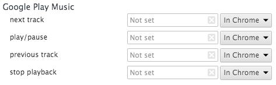

---
aliases:
- /2014/07/30/playpause-button-stopped-working-in-os-x-mavericks/
author: Major Hayden
date: 2014-07-30 14:31:04
tags:
- chrome
- keyboard
- mac
title: Play/pause button stopped working in OS X Mavericks
coverAlt: Mac chiclet keyboard
coverCaption: |
  <a href="https://www.flickr.com/photos/26572975@N00/1371111259/">Andrew*</a>
  via <a href="http://compfight.com">Compfight</a> <a href="https://creativecommons.org/licenses/by-sa/2.0/">cc</a>
---

My play/pause button mysteriously stopped working in iTunes and VLC mysteriously this week on my laptop. It affected the previous track and next track buttons as well. It turns out that my Google Music extension in Chrome stole the keyboard bindings after the extension updated this week.

If your buttons stopped working as well, follow these steps to check your keyboard shortcuts in Chrome:

  * Choose **Preferences** in the **Chrome** menu in the menu bar
  * Click **Extensions** in the left sidebar
  * Scroll all the way to the bottom of the page
  * Click **Keyboard Shortcuts**
  * Look at the key bindings in the **Google Play Music** section

Your shortcuts might look like the ones shown here in an [Apple support forum][2]. Click each box with the X to clear each key binding or click on the key binding box itself to bind it to another key combination. If you do that, it should end up like this:

You also have the options of switching the shortcuts to only work within Chrome by using the drop down menus to the right of the key binding boxes.

[2]: https://discussions.apple.com/message/25754447#25754447