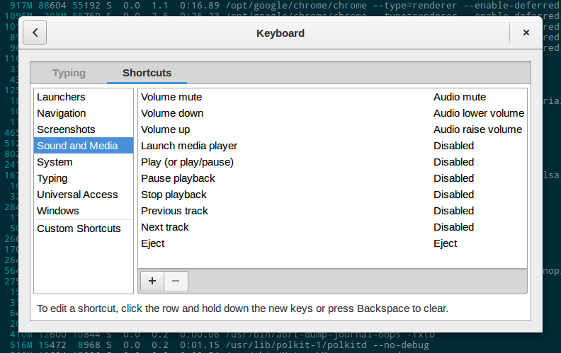

---
aliases:
- /2015/02/20/using-playpause-buttons-in-chrome-with-gnome-3/
author: Major Hayden
date: 2015-02-20 14:21:44
tags:
- chrome
- fedora
- gnome
title: Using play/pause buttons in Chrome with GNOME 3
---

I [wrote a post last summer][1] about preventing Chrome from stealing the media buttons (like play, pause, previous track and next track) from OS X. Now that I'm using Linux regularly and I fell in love with Google Play Music All Access, I found that GNOME was stealing the media keys from Chrome.

The fix is quite simple. Press the SUPER key (Windows key or Mac Command key), type settings, and press enter. Click on **Keyboard** and then on the **Shortcuts** tab. You should now see something like this:

Click on each entry that shows _Disabled_ above. After clicking on the entry, press your backspace key to clear the shortcut. If you're using a Mac keyboard, that's your oddly-named delete key that sits right above the pipe/backslash key.

You should be set to go once they're all cleared out. If you disabled the media keys in Chrome, [go to this post][1] and do all of the steps in reverse. ;)

 [1]: /2014/07/30/playpause-button-stopped-working-in-os-x-mavericks/
