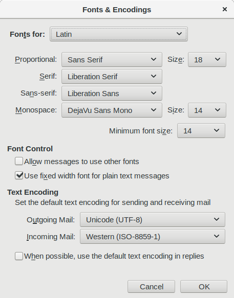

---
aliases:
- /2017/08/02/thunderbird-changes-fonts-messages-not/
author: Major Hayden
date: 2017-08-02 12:54:38
tags:
- fedora
- mail
- thunderbird
title: Thunderbird changes fonts in some messages, not all
---

[Thunderbird][1] is a great choice for a mail client on Linux systems if you prefer a GUI, but I had some problems with fonts in the most recent releases. The monospace font used for plain text messages was difficult to read.

I opened **Edit > Preferences > Display** and clicked **Advanced** to the right of **Fonts & Colors**. The default font for monospace text was "Monospace", and that one isn't terribly attractive. I chose "DejaVu Sans Mono" instead, and closed the dialog boxes.

The fonts in monospace messages didn't change. I quit Thunderbird, opened it again, and still didn't see a change. The strange part is that a small portion of my monospaced messages were opening with the updated font while the majority were not.

I went back into Thunderbird's preferences and took another look:

Everything was set as I expected. I started with some Google searches and stumbled upon a Mozilla Bug: [Changing monospace font doesn't affect all messages][3]. One of the participants in the bug mentioned that any emails received without ISO-8859-1 encoding would be unaffected since Thunderbird allows you set fonts for each encoding.

I clicked the dropdown where "Latin" was selected and I selected "Other Writing Systems". After changing the monospace font there, the changes went into effect for all of my monospaced messages!

 [1]: https://www.mozilla.org/en-US/thunderbird/
 [3]: https://bug1234567.bugzilla.mozilla.org/show_bug.cgi?id=546877