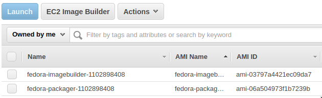
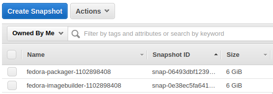

---
aliases:
- /2021/08/06/build-fedora-aws-images-in-github-actions-with-image-builder/
author: Major Hayden
date: '2021-08-06'
summary: Build images for AWS and deploy them to your AWS account all within GitHub
  Actions. 🤖
tags:
- aws
- cloud
- fedora
- github
- imagebuilder
- linux
title: Build Fedora AWS images in GitHub Actions with Image Builder
---

[GitHub Actions] provides infrastructure for all kinds of amazing automation.
Anyone can test software, build packages, deploy applications, or even publish a
blog (like this one!) with a few snippets of YAML. I often use it to bundle my
software in a container after testing it. 🤖

One day, as I was working through another [Packer] configuration, I wondered if
there was a way to build cloud images directly in GitHub Actions without
building an instance in the cloud, making tons of changes, and snapshotting that
image. Building a cloud image without booting it first seems like a cleaner way
to work and it seems like it could be an easier workflow.

I worked on the [Image Builder] team at Red Hat last year and really enjoyed the
way we could build an image anywhere and then ship that image anywhere. That
gave me an idea: What if I could use Image Builder in GitHub Actions to ship
images to AWS with all the customizations I want, perhaps even on a schedule? 🤔

[GitHub Actions]: https://github.com/features/actions
[Packer]: https://www.packer.io/
[Image Builder]: https://www.osbuild.org/

## What is Image Builder?

The idea behind Image Builder is that anyone should be able to create images for
various clouds and virtualization platforms with some simple software. Nobody
should worry about how a particular cloud sets up cloud-init or what kernel
configuration might be required to run in a particular cloud. Someone should do
that for you and you should focus on what you need in your images to be
successful at your task.

Image Builder has two parts:

* **osbuild:** It drives the low-level image building processes. All of the
  loopback setup, image packaging, and per-cloud configuration adjustments all
  happen here.

* **osbuild-composer:** It exposes different APIs which allow you to specify how
  the image should be built in a brief TOML configuration. You pass the TOML
  blueprint to osbuild-composer, tell it what type of image you want, and where
  you want the image delivered. It takes care of all of that.

You can get Image Builder on all current versions of Fedora, CentOS Stream, and
Red Hat Enterprise Linux 8.3 or later. Install it via `dnf`:

```shell
$ sudo dnf install osbuild-composer
$ sudo systemctl enable --now osbuild-composer.socket
```

If you love to DIY (do it yourself), read my [Build AWS images with Image
Builder] blog post from last summer. From here on out, I'll only talk about
consuming Image Builder via GitHub Actions.

[Build AWS images with Image Builder]: /2020/06/19/build-aws-images-with-imagebuilder/

## Challenges

Building images in GitHub Actions comes with some challenges. For example, the
only Linux choice is Ubuntu but Image Builder is not supported on Ubuntu
currently. Luckily, we have containers!

I started with a [repository to build containers with Image Builder included].
The repository [builds containers] for Fedora 34, Fedora rawhide (the next
Fedora release), and CentOS Stream 8. You can download these containers locally
and run them, too:

```shell
# With podman
$ podman pull ghcr.io/major/imagebuilder:centos-stream8
$ podman pull ghcr.io/major/imagebuilder:fedora-34
$ podman pull ghcr.io/major/imagebuilder:fedora-rawhide
# With docker
$ docker pull ghcr.io/major/imagebuilder:centos-stream8
$ docker pull ghcr.io/major/imagebuilder:fedora-34
$ docker pull ghcr.io/major/imagebuilder:fedora-rawhide
```

Image Builder relies on [systemd socket activation] and that means systemd must
be running inside the container. For nearly all systems, that requires adding
the `--privileged` argument when you run the container and running the container
as root. It's not ideal, but it works fine in GitHub Actions since the instance
is thrown away immediately after the image build is done.

To run these containers on your local system, you may need something like this:

```shell
$ sudo podman run --rm --detach --privileged --name imagebuilder \
    ghcr.io/major/imagebuilder:fedora-34
```

Initially, I thought the single CPU on the Actions runner would make the build
process too slow, but I was pleasantly surprised to see that most builds
finished in 4-7 minutes. The network throughput from the runner to AWS was also
quite fast. 👏🏻

[repository to build containers with Image Builder included]: https://github.com/major/imagebuilder
[builds containers]: https://github.com/major/imagebuilder/pkgs/container/imagebuilder
[systemd socket activation]: https://www.freedesktop.org/software/systemd/man/systemd.socket.html

## Building images

I often need a Fedora container or VM for doing packaging work and testing other
contributors' packages, so I set out to make a proof of concept for Fedora. My
proof of concept is over in GitHub at [major/imagebuilder-fedora]. You can fork
my PoC and customize everything as you wish!

The workflow follows a set of steps that I'll explain below.

First, we need AWS credentials so we can drop off the image at AWS. There is a
[basic template in TOML format] that contains placeholders for account
credentials and other data:

```toml
provider = "aws"

[settings]
accessKeyID = "$AWS_ACCESS_KEY_ID"
secretAccessKey = "$AWS_SECRET_ACCESS_KEY"
bucket = "$AWS_S3_BUCKET"
region = "$AWS_DEFAULT_REGION"
key = "$IMAGE_KEY"
```

The [actions workflow] fills in that TOML file with information from GitHub
Actions secrets and environment variables:

```yaml
- name: Fill in the AWS template
  run: |
    cat shared/aws-template.toml | envsubst > shared/aws-config.toml
  env:
    AWS_ACCESS_KEY_ID: ${{ secrets.AWS_ACCESS_KEY_ID }}
    AWS_SECRET_ACCESS_KEY: ${{ secrets.AWS_SECRET_ACCESS_KEY }}
    AWS_S3_BUCKET: major-aws-image-import
    AWS_DEFAULT_REGION: us-east-1
    IMAGE_KEY: "${{ matrix.blueprint }}-${{ github.run_id }}"
```

From there, the workflow runs the [build-image.sh] script and here's where the
fun starts. The container starts up and we wait for the osbuild-composer API to respond:

```bash
# Start the container.
echo "🚀 Launching the container"
sudo podman run --rm --detach --privileged \
    -v $(pwd)/shared:/repo \
    --name $CONTAINER_NAME \
    $CONTAINER

# Wait for composer to be fully running.
echo "⏱ Waiting for composer to start"
for i in `seq 1 10`; do
    sleep 1
    composer-cli status show && break
done
```

Once the API is up, we *push* the blueprint into osbuild-composer and tell it to
solve the dependencies. The `depsolve` step is optional, but it can find
problems with your package set fairly quickly so you can make adjustments.

```bash
echo "📥 Pushing the blueprint"
composer-cli blueprints push /repo/${BLUEPRINT_NAME}.toml

echo "🔎 Solving dependencies in the blueprint"
composer-cli blueprints depsolve ${BLUEPRINT_NAME} > /dev/null
```

The blueprints are in the `shared` directory in the repository. For example,
there's a [fedora-imagebuilder] blueprint that builds an image with Image
Builder inside it so you can build an image with Image Builder with Image
Builder. (This reminds me of a meme. 🤭)

```toml
name = "fedora-imagebuilder"
description = "Image Builder - rawhide"
version = "0.0.2"
modules = []
groups = []

[[packages]]
name = "cockpit-composer"
version = "*"

[[packages]]
name = "osbuild"
version = "*"

[[packages]]
name = "osbuild-composer"
version = "*"

[customizations.services]
enabled = ["cockpit.socket", "osbuild-composer.socket"]
```

Now we're ready to build the image (or in Image Builder terms, *start the
compose*). After starting it, we extract the ID of the compose so we can monitor
it while it runs.

```bash
if [[ $SHIP_TO_AWS == "yes" ]]; then
    echo "🛠 Build the image and ship to AWS"
    composer-cli --json \
        compose start $BLUEPRINT_NAME ami $IMAGE_KEY /repo/aws-config.toml \
        | tee compose_start.json > /dev/null
else
    echo "🛠 Build the image"
    composer-cli --json compose start ${BLUEPRINT_NAME} ami | tee compose_start.json
fi

COMPOSE_ID=$(jq -r '.body.build_id' compose_start.json)
```

I get a little nervous when I can't see any status updates, so I follow the
systemd journal while the build runs. The script checks on the build frequently
to see if it has finished. This process takes about 4-7 minutes in GitHub
Actions for most of the images I've built.

```bash
# Watch the logs while the build runs.
podman-exec journalctl -af &

COUNTER=0
while true; do
    composer-cli --json compose info "${COMPOSE_ID}" | tee compose_info.json > /dev/null
    COMPOSE_STATUS=$(jq -r '.body.queue_status' compose_info.json)

    # Print a status line once per minute.
    if [ $((COUNTER%60)) -eq 0 ]; then
        echo "💤 Waiting for the compose to finish at $(date +%H:%M:%S)"
    fi

    # Is the compose finished?
    if [[ $COMPOSE_STATUS != RUNNING ]] && [[ $COMPOSE_STATUS != WAITING ]]; then
        echo "🎉 Compose finished."
        break
    fi
    sleep 1

    let COUNTER=COUNTER+1
done
```

Once the images finish building and they deploy to AWS (usally less than 15
minutes altogether), you should be able to see them inside your AWS account:





[major/imagebuilder-fedora]: https://github.com/major/imagebuilder-fedora
[basic template in TOML format]: https://github.com/major/imagebuilder-fedora/blob/main/shared/aws-template.toml
[actions workflow]: https://github.com/major/imagebuilder-fedora/blob/main/.github/workflows/main.yml
[build-image.sh]: https://github.com/major/imagebuilder-fedora/blob/main/build-image.sh
[fedora-imagebuilder]: https://github.com/major/imagebuilder-fedora/blob/main/shared/fedora-imagebuilder.toml

## Extra credit

Your automation doesn't have to end here! 🤖

You can also add extra repositories to your compose with `composer-cli sources
add...` if you have custom repositories with your software or if you need
packages from [RPMFusion].

GitHub Actions could boot an instance from your image, run some basic tests, and
apply tags to the AMI to make provisioning easier. I always like having an AMI
with a `latest` tag so I can deploy from the most recently built image whenever
I need to test something.

[RPMFusion]: https://rpmfusion.org/

*Photo credit: [Cameron Venti on Unsplash](https://unsplash.com/photos/tm_pBZ5UHiU)*