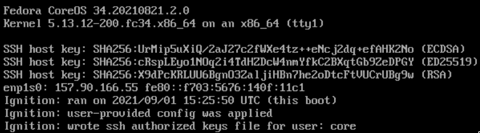

---
aliases:
- /2021/08/20/deploy-fedora-coreos-in-hetzner-cloud/
author: Major Hayden
date: '2021-08-20'
summary: Launch your containers on Fedora CoreOS instances in Hetzner cloud with a
  few workarounds. 🚀
tags:
- cloud
- coreos
- fedora
- hetzner
- linux
title: Deploy Fedora CoreOS in Hetzner cloud
---

[Hetzner] has always been a reliable and cost-effective hosting company for me
for several years. I've run [icanhazip.com] on their dedicated servers and I run
several small applications in [their cloud].

When I run containers, I love using [Fedora CoreOS] for its easy updates and
very small server footprint. Almost everything you need for hosting containers
is provided right out of the box, but you can add extra packages via
[rpm-ostree] layers and reboot to use them.

This post shows you how to deploy Fedora CoreOS in Hetzner's cloud as an
inexpensive and efficient method for hosting your container workloads.

[Hetzner]: https://www.hetzner.com/
[icanhazip.com]: https://icanhazip.com
[their cloud]: https://www.hetzner.com/cloud
[Fedora CoreOS]: https://getfedora.org/en/coreos?stream=stable
[rpm-ostree]: https://coreos.github.io/rpm-ostree/

## Roadblocks

First off, Hetzner does not offer Fedora CoreOS as one of its cloud base images.
That normally wouldn't be a problem, but they don't allow you to upload
snapshots or base images, either. Don't worry! We can think creatively and
deploy the image via the cloud rescue environment.

Another challenge is that [ignition], the CoreOS first boot configuration tool,
does not support Hetzner's metadata service at this time. I'm working on a [pull
request] to add this support. We can get creative here and embed our ignition
configuration inside the instance itself. That's a bit annoying since all of
your instances will get the same configuration, but that works out fine for my
needs since I mainly care about ssh keys being present.

[ignition]: https://github.com/coreos/ignition
[pull request]: https://github.com/coreos/ignition/pull/1262

## Generating ignition configuration

The ignition configuration allows us to specify ssh keys (and many other
possible configurations) for the first boot. First, we start with a really basic
[butane configuration]:

```yaml
# hetzner-coreos.butane
variant: fcos
version: 1.4.0
passwd:
  users:
    - name: core
      groups:
        - wheel
      ssh_authorized_keys:
        - ssh-rsa AAAAB3NzaC1y...
```

You can use any username here that you prefer and add your public ssh key.
Compile the configuration into an ignition file with butane:

```console
butane hetzner-coreos.butane > config.ign
```

Keep this `config.ign` file handy because we need it before we snapshot our
Fedora CoreOS image later.

[butane configuration]: https://coreos.github.io/butane/examples/

## Prepare the CoreOS snapshot

Although Hetzner doesn't allow for uploading your own snapshot, you can replace
the entire root disk of an instance from the rescue system. From there, we can
snapshot the root disk storage and use that as our new base image.

Download and install the [hcloud] tool first. Follow the installation
instructions to generate an API key and store it on your system.

Start by building a basic Fedora 34 instance where we can deploy the Fedora
CoreOS image:

```console
$ hcloud server create --datacenter nbg1-dc3 --image fedora-34 \
    --type cpx11 --name coreos-deployer
```

Activate the rescue system for the instance you just created and reboot into the
rescue environment:

```console
$ hcloud server enable-rescue coreos-deployer
1.148s [=================================] 100.00%
Rescue enabled for server 14168423 with root password: xxxxx
$ hcloud server reboot coreos-deployer
656ms [==================================] 100.00%
Server 14168423 rebooted
```

Use ssh to log into the rescue environment (user: `root`, password provided in
the `enable-rescue` step). The rescue environment is in a ramdisk and we don't
have enough space to build the [coreos-installer] or download a raw disk, but we
can get creative and stream the filesystem directly from a Fedora CoreOS image
download.

I prefer to live dangerously and I run the testing release, but there are [three
releases available for download]. Download, decompress, and write the image to
the root disk all at once:

```bash
export COREOS_DISK="https://builds.coreos.fedoraproject.org/prod/streams/testing/builds/34.20210821.2.0/x86_64/fedora-coreos-34.20210821.2.0-metal.x86_64.raw.xz"
curl -sL $COREOS_DISK | xz -d | dd of=/dev/sda status=progress
```

This process should take one or two minutes to complete.

## Embed the ignition configuration

We could hop out of rescue now and reboot right into Fedora CoreOS, but we need
to provide SSH keys for our instance. The `config.ign` file we generated in the
first section of this post will be deployed as `/ignition/config.ign` in the
image.

Let's find the boot partition:

```console
# fdisk -l /dev/sda
Disk /dev/sda: 38.2 GiB, 40961572864 bytes, 80003072 sectors
Disk model: QEMU HARDDISK
Units: sectors of 1 * 512 = 512 bytes
Sector size (logical/physical): 512 bytes / 512 bytes
I/O size (minimum/optimal): 512 bytes / 512 bytes
Disklabel type: gpt
Disk identifier: 00000000-0000-4000-A000-000000000001

Device       Start     End Sectors  Size Type
/dev/sda1     2048    4095    2048    1M BIOS boot
/dev/sda2     4096  264191  260096  127M EFI System
/dev/sda3   264192 1050623  786432  384M Linux filesystem   « boot
/dev/sda4  1050624 5003230 3952607  1.9G Linux filesystem   « root
```

Mount the boot partition and deploy the `config.ign`:

```console
mount /dev/sda3 /mnt
mkdir /mnt/ignition
vi /mnt/ignition/config.ign      « copy/paste your config.ign from earlier
umount /mnt
```

Let's power off the instance to avoid booting it. We want all subsequent boots
to be as clean as possible.

```console
root@rescue ~ # poweroff
```

## Make the snapshot

Create a snapshot from our powered off server:

```console
hcloud server create-image --description fedora-34-coreos \
    --type snapshot coreos-deployer
```

This usually takes 1-2 minutes. Let's get our image ID:

```console
$ hcloud image list | grep fedora-34-coreos
46874212   snapshot   -                 fedora-34-coreos   0.96 GB      40 GB       Wed Sep  1 10:07:04 CDT 2021   -
```

## Boot the instance

Now that we have a snapshot with our ignition configuration embedded in it,
let's make a new instance!

```console
hcloud server create --datacenter nbg1-dc3 --image 46874212 --type cpx11 \
    --ssh-key personal_servers --name first-coreos-instance
```

Hetzner normally boots cloud images **really quickly**, but it takes a bit
longer when booting from snapshots. I assume that they have the common base
images cached on most hypervisors so they can provision them really quickly. The
delay isn't too bad here: the instances usually take about 90 seconds to boot.

Once it boots, you should see notes from ignition on bootup about your
configuration:



Use ssh to login as the `core` user:

```console
$ ssh core@INSTANCE_IP_ADDRESS
Fedora CoreOS 34.20210821.2.0
Tracker: https://github.com/coreos/fedora-coreos-tracker
Discuss: https://discussion.fedoraproject.org/c/server/coreos/

[core@localhost ~]$ podman --version
podman version 3.3.0
```

## Wrapping up

Now that you have a snapshot made, you can delete your original instance (I
called it `coreos-deployer` above) and just build off that snapshot whenever you
need to. That should save you a few Euros per month. 💸

Once ignition has support for Hetzner's metadata service, the extra step of
embedding your configuration won't be needed.

Also, if anyone from Hetzner is reading this post, I'd love to get Fedora CoreOS
as one of the options for base images in your cloud! 🤗

[hcloud]: https://github.com/hetznercloud/cli
[coreos-installer]: https://coreos.github.io/coreos-installer/
[three releases available for download]: https://getfedora.org/en/coreos/download?tab=cloud_launchable&stream=stable

*Photo credit: [Daniel Seßler on Unsplash](https://unsplash.com/photos/K3fQgNfKUoc)*