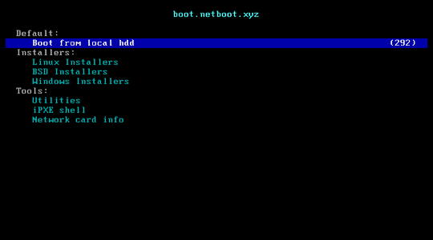

---
aliases:
- /2022/09/02/pxe-boot-netboot.xyz-on-a-mikrotik-router/
author: Major Hayden
date: '2022-09-02'
summary: Get systems online quickly or rescue a broken system by PXE booting from
  netboot.xyz using a Mikrotik router. 🛠
tags:
- fedora
- linux
- mikrotik
- networking
- pxe
title: PXE boot netboot.xyz on a Mikrotik router
---

The first RFCs for [PXE], or preboot execution environment, showed up in June 1981 and it's still a popular tool today.
It enables computers to boot up and download some software that runs early in the boot process.

Although PXE has been with us for ages, it's still extremely relevant today:

* **Provisioning:** Deploying new operating systems to machines is easily automated with PXE.
* **Rescue:** Fix a broken system by booting into a live OS and then make repairs.
* **Validation:** PXE boot a machine into a validation suite that checks hardware or puts it through a burn-in process.
* **Ephemeral OS:** Boot into a live operating system that runs completely in RAM and disappears on reboot.

A good friend of mine started a project to take PXE booting to the next level.

[PXE]: https://en.wikipedia.org/wiki/Preboot_Execution_Environment

# Enter netboot.xyz

Most of the PXE deployments I've used in the past were restricted to a company's internal network for specfic uses.
These deployments often served as a provisioning method.

Although the actual mechanisms for booting machines via PXE are not difficult, writing the backend scripts and creating keyboard-friendly menus is challenging.
One of my favorite people on the planet, [Ant Messerli], started the [netboot.xyz] project several years ago.

What does netboot.xyz do for you?
For one, you don't need to write your own menu scripts.
All you do is PXE boot and use the menus already available on the site.
You can even add your own in [netboot.xyz's GitHub repository]

The site relies on [ipxe], an open source boot firmware.
There's no need to compile your own ipxe binary.
netboot.xyz offers [pre-built ipxe binaries] that already connect you to netboot.xyz on the first boot!

Here's what you'll see from netboot.xyz on your first boot:



# PXE ingredients

Now that netboot.xyz did the hard part, what's left?
A PXE environment requires a few items:

* DHCP server
* TFTP server

The DHCP server normally tells the machine about its IP address, gateway, DNS servers and more.
However, we need it to provide two extra pieces of information:

* The server running a TFTP daemon
* The filename to request

The boot process for a machine on your network will go something like this:

* Machine makes a DHCP request
* Your DHCP server replies with the usual IP information plus a server IP and filename for the PXE software
* Machine sets its IP, gateway, netmask, and DNS
* Machine downloads the PXE software from the server provided by the DHCP server
* PXE software runs on the machine

[Ant Messerli]: https://github.com/antonym
[netboot.xyz]: https://netboot.xyz
[netboot.xyz's GitHub repository]: https://github.com/netbootxyz/netboot.xyz
[ipxe]: https://ipxe.org/
[pre-built ipxe binaries]: https://netboot.xyz/downloads/

# Mikrotik PXE configuration

Let's update the DHCP server configuration first.
Log into your Mikrotik router via ssh and add configuration to your DHCP server's network configuration

```text
[major@hexs] > /ip/dhcp-server/
[major@hexs] /ip/dhcp-server> 
[major@hexs] /ip/dhcp-server/network> print
Columns: ADDRESS, GATEWAY, DNS-SERVER
# ADDRESS          GATEWAY       DNS-SERVER  
0 192.168.10.0/24  192.168.10.1  192.168.10.1
[major@hexs] /ip/dhcp-server/network> set next-server=192.168.10.1 boot-file-name=pxeboot numbers=0
```

Great.
Now our DHCP server will tell new machines where to find their PXE image.
Now we need to get our PXE boot image.
Most of my machines support UEFI, so I use the [UEFI DHCP image].
Upload the image to the mikrotik however you prefer.
I normally use FTP or the web interface.

My PXE image is stored on the Mikrotik as `/netboot.xyz/netboot.xyz.efi`.
Now we can set configure the Mikrotik's built-in FTP server:

```text
[major@hexs] > /ip tftp
add ip-addresses=192.168.10.0/24 real-filename=\
    /netboot.xyz/netboot.xyz.efi req-filename=.*
[major@hexs] > /ip tftp settings
set max-block-size=8192
```

These settings enable TFTP access for anything on my LAN.
Also, my PXE image from netboot.xyz is returned no matter what is in the request.

Now it's time for a quick test! On Fedora, you can install a `tftp` client by running `dnf install tftp`.

```console
❯ tftp 192.168.10.1 -v -m binary -c get pxeboot
mode set to octet
Connected to 192.168.10.1 (192.168.10.1), port 69
getting from 192.168.10.1:pxeboot to pxeboot [octet]
Received 1074688 bytes in 0.6 seconds [14810621 bit/s]
```

Awesome! Let's make sure we downloaded everything correctly:

```console
# Check the software downloaded from TFTP
❯ sha256sum pxeboot                    
ef4b7d62d360bd8b58a3e83dfa87f8c645d459340554ce4ad66c0ef341fc3653  pxeboot

# Check our original file
❯ sha256sum ~/Downloads/netboot.xyz.efi
ef4b7d62d360bd8b58a3e83dfa87f8c645d459340554ce4ad66c0ef341fc3653  /home/major/Downloads/netboot.xyz.efi
```

Now your systems on your local network can PXE boot using netboot.xyz!
During the boot routine, you may need to press a key (usually F12, F11, F2, or maybe DEL) to bring up a boot selection menu.
Pick the PXE or network boot option (choose IPv4 if asked) and boot!

During the boot, your machine will boot the locally downloaded PXE image and it will automatically call out to netboot.xyz for menu selections.
Scroll through the menus, choose your image, and enjoy! 🤓

[UEFI DHCP image]: https://boot.netboot.xyz/ipxe/netboot.xyz.efi
