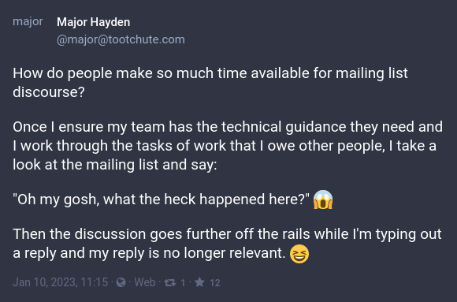

🥵 _**This post is long.** If you need a TL;DR, just [hop down to the end](#tldr)._

One of my toots fell into a [Fedora Development mailing list discussion](https://lists.fedoraproject.org/archives/list/devel@lists.fedoraproject.org/thread/Z2T5WKUTHNLS2SVCVAWNYYRIBK3NGF32/) recently that was titled _"It's time to transform the Fedora devel list into something new."_
As you might imagine, that post blew up.

Here's the [toot](https://tootchute.com/@major/109666036733834421):



After 20 days and 218 emails from 63 participants, the discussion continues.
A few people reached out with questions and comments to better understand where I was coming from in that tweet.

Long story short: **My beef[^beef] isn't about the venue, the technology, or the people.**

My issues are centered around the discourse itself and the time required to parse it.

# Time

One of my favorite leaders of all time once caught me off guard during a development conversation:

> Them: Major, what's the most valuable thing you have that you can give to someone else?
>
> Me: What I know?
>
> Them: No.
>
> Me: My ability to understand what they need?
>
> Them: No.
>
> Me: Okay, just tell me.
>
> Them: Your time.

He made a point that time is something you can't get back and it's why companies pay people.
Companies pay people for their _time_.

_Time_ spent doing hard things.

_Time_ spent away from family.

_Time_ spent building something new or repairing something that's broken.

_Time_ spent doing tasks that nobody else wants to do.

Humans jump at anything that saves them a little time.
We stream Netflix instead of going to the video store or getting DVDs in the mail.
We sign up for Amazon Prime to save time on shopping.
We rely on appliances to do work for us so we have time for other things.

# Mailing lists

Anyone working on open source projects of any scale have likely used mailing lists from time to time.
If you're not familiar, here's an example workflow:

* You write an email to a special email address with a question, comment, or a request for help
* That email goes into a system which distributes the email to people who are interested in that topic
* Mailing list subscribers submit their replies asynchronously until the issue is resolved (or everyone is exhausted)
* Hopefully you got what you needed

**But this post isn't about technology.**
You can have asynchronous discussions of varying quality levels just like these in other systems, such as Discourse, forums, Reddit, or bug trackers.
There's nothing inherently bad about mailing lists in general.
Mailing lists just happen to be very common in open source projects.

So what is this post about?

# Unorganized discourse

When someone asks for comments on a topic, especially a controversial one, they get a wide array of replies:

1. People who don't understand and have questions
1. People who dislike change in all its forms
1. People who dislike your change and provide use cases describing how it's bad
1. People who dislike your change
1. People who heard there's a fight and they can't stay away
1. People who like parts of your idea but want to make changes
1. People who like everything you said[^change-likers]
1. People who meant to reply to another thread but replied on yours instead
1. People who are upset about someone else who [top posted](https://en.wikipedia.org/wiki/Posting_style#Top-posting) 🤭
1. No reply at all

Filtering through all of these to get to the heart of the argument **is incredibly tedious and time consuming.** 🥵

As Matthew Miller mentioned in his Fedora thread, long threads often cause people to lose the meaning of the discussion.
They reply on third, fourth, and fifth level comments in the thread that often veer into other topics.
Nobody can rein in the discussion at that point, but people do try.
Again, these issues crop up in all kinds of discussion technology systems.
They are not unique to mailing lists.

# Improvements

The problem is not the mailing list. **It's the discourse.**

Keeping the discourse more organized is a good option, but its effectiveness is largely governed by the project's communication rules and the civility of those who communicate in the thread.
How do we make this better?

## Provide the why

I'm often amazed at some of the change proposals I see where the technical solution looks so elegant.
It's so easy to maintain.
It won't be difficult to test.
We could implement it so quickly.
This person is a genius!

Then I stop.
Wait a minute.
**Why do we need to do this?**

Always include some of the backstory and use cases behind the change.
Ask yourself a few questions:

* Why do we need to make the change?
* Who benefits?
* Who is harmed?
* What happens if we don't make the change?
* Do we have alternatives to the proposed change?
* Can the change be broken up into smaller pieces?

Include these in your original post to ensure everyone is on a level playing field at the start.
This reduces replies requesting more information or questioning the value of the change based on a lack of understanding.

## Intermission summary

When I've written posts that blew up, I took time to read through the replies and summarize the comments thus far.
I do this as a reply to my original post[^self-reply] with a bulleted list.

As an example:

```text
Thanks for all the replies! So far, this is what I've heard
in the thread:

1. Most people think the first change makes sense and should
   be done soon
2. The second change requires some more thought based on the
   use cases provided by lumpynuggets25
3. We need better documentation to explain why we are making
   this change
```

This saves time for newcomers to the thread since they can get a brief summary of the comments made thus far without needing to read all of them first.
In addition, it gives some of the people who replied a chance to say _"Yes, that's what I meant. Thank you."_
It also redirects the conversation back to the original topic and reduces the veering off into other topics.

## Be patient

I've seen many threads where the original author obviously felt the need to reply to every comment that came through.
This lengthens the thread unnecessarily and causes you to think more about replying rather than understanding the replies.
_(Other participants in the thread may start doing this themselves.)_

When you send something and the replies start rolling in, just be patient.
Sometimes others will engage each other in the thread and answer your questions for you.
This gives you time to read and understand what people are saying.
You also get the opportunity to build that intermission summary from the previous section. 😉

## Let it go

Just like Elsa sang in [Frozen](https://en.wikipedia.org/wiki/Frozen_(2013_film)), sometimes you have to let it go:

> Let it go, let it go
>
> Can't hold it back anymore
>
> Let it go, let it go
>
> Turn away and slam the door
>
> I don't care what they're going to say
>
> Let the storm rage on
>
> The cold never bothered me anyway

There's always going to be that time where you need to walk away.
Take the feedback you received, build on it, and deliver something valuable for people.
Let the people who want to be angry for the sake of being angry just be angry on their own.

Every thread reaches that point where the people with real comments have provided all of their feedback.
Other people just get exhausted with the conversation.
That leaves the people who have nothing better to do, and of course, the [trolls](https://en.wikipedia.org/wiki/Troll_(slang)).
_(Don't feed the trolls.)_

# TL;DR

Just to summarize:

* Mailing lists aren't evil, but unorganized discourse in any medium becomes a time sink and that's evil
* Always provide the "why" along with the "what"
* Take time to repeat back what was said in a summary
* Let the comments roll in before considering a limited amount of replies
* Know when to let it go and build something great


[^beef]: The word _beef_ is [used informally](https://dictionary.cambridge.org/us/dictionary/english/beef) in English as a replacement for _complaint_.
[^change-likers]: Always compliment these people.
    When people fully agree, they don't reply that often because they feel like they have nothing to add.
    Sticking your neck out to say "This is good and here's why..." is just as treacherous as disagreeing.
[^self-reply]: Some people frown on replying to yourself in a mailing list thread.
    Are you adding value to the thread?
    If so, ignore them.