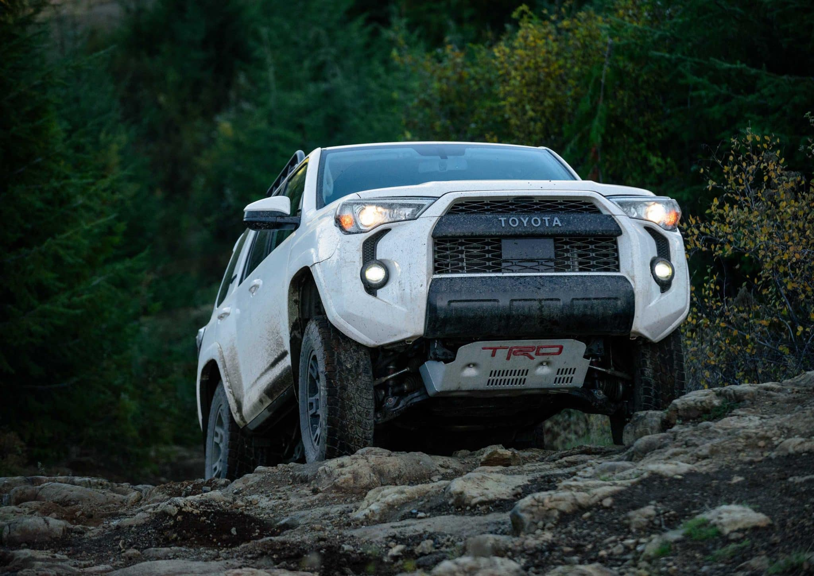

I replaced my old Toyota 4Runner with a new one so I could snag the last run of the 5th generation.
It's a tough, reliable vehicle with just enough space for my family and our pets.

However, this new one came with the same problem as my old one.
All of the bolts that hold in the front skid plate were mostly stripped.
Getting them out was difficult and I knew getting them back in would be worse.

I'll cover how to fix it in this post.
**If you're in a hurry, scroll past the next section!**
Otherwise, let's get a little backstory.

## Backstory

All [4Runner models](https://en.wikipedia.org/wiki/Toyota_4Runner) are made in Japan in the [Tahara Plant](https://en.wikipedia.org/wiki/Toyota_Motor_Corporation_Tahara_plant).
The build quality is fantastic and you can tell that they're built with care.
You can even find brief notes in Japanese inside the fenders or underneath the car where someone jotted some notes about something.

After careful assembly in Japan, they head to various US ports where American workers add on any extra items that come with the trim level.
That could include an upgraded exhaust, different wheels, or in my case, skid plates.

The skid plate is a sturdy piece of steel that mounts under the front of the vehicle and protects lots of important components from damage.
You can see it under the front bumper in this photo:

If you've ever owned a Toyota, you know that the factory is strict about torque applied to various bolts all over the vehicle.
All of that gets thrown out the window when the workers at the US ports add on accessories.

Based on all the complaints I've seen across various 4Runner forums, they must use air wrenches or some kind of impact wrench to put on the bolts.
If the bolt isn't in straight when they start, it destroys the bolt and causes problems with the mount holes.
They also tighten the bolts _far past the acceptable torque specs._

To make matters worse, if you take your car in for an oil change at most places, **they'll have an impact wrench handy to ruin the bolts a bit more for you.**

## Root cause

If you have bolts that are getting stripped in the mount holes or they're getting stuck as you try to bring the bolts in or out, you likely have chunks of metal from the bolts wedged in the threads of the bolt holes.

## Ingredients

The fix is quite cheap but very tedious.
You'll need a few parts to get started:

* [Irwin Hanson 12002 T-Handle Tap Wrench (1/4" to 1/2")](https://a.co/d/8EkxZxh):
  This T-Handle wrench allows you to easily spin the tap screw to clear the metal fragments from your bolt holes.
  **Don't use a socket set, drill, screwdriver, or anything powerful!**
  You want to take this _slow_.

* [Irwin Tap 10-1 25mm Plug](https://a.co/d/gy02vOu):
  The bolts that go into the holes are M10 bolts with a 25mm thread, so this tap should fit perfectly.

* [Toyota part PT938-00140-AA](https://a.co/d/grHmNR4):
  This includes four new bolts with spacers and retaining washers to replace your stripped bolts.

* **14mm socket and socket wrench OR a 14mm wrench:**
  You'll need this for removing the bolts and dealing with the hardware for the skid plate.

* **Some type of lubricant.**
  I used WD-40, but don't tell anyone.
  People love to fight about whether WD-40 is a solvent, a grease, or a lubricant. 🤷‍♂️

What's hilarious is that if you load the Amazon page for the Toyota part, it shows that everyone is buying tap screws and T-Handle wrenches:

## Fix the bolt holes

First things first, you'll need to get that skid plate off.
**I strongly recommend taking the rear bolts off first.**
If the bolts get stuck on the way out, take your time.
I found that rocking in the other direction briefly and then trying to loosen them again seemed to work.

With the rear bolts out, move to the bolts closest to the front of the car.
Put a box or something sturdy underneath the skid plate that allows it to drop when it's loose but prevents it from knocking out one of your teeth when it falls. 🤕

When you loosen the front bolts, try loosening one of them 4-5 turns and then go to the other one.
Keep going back and forth loosening the bolts until they loosen from the frame of the car.
There are retaining washers on the top side of the bolt and removing those bolts aggressively will slide the retaining washers right off the bolt.

Now you're ready to tap! 👏

Start in with the bolt holes in the rear and spray a decent amount of lubricant in the bottom and top of the bolt hole.
Get your tap into the T-Handle wrench and slowly start turning it in the bolt hole like you were installing one of the bolts.

🛑 **When you hit resistance, only go 1/2 to 1 turn further.**
Then back up 2-3 turns.
This means you've dislodged some metal fragments in the threads!

After backing up a bit, keep screwing it in further until you hit more resistance.
Only go 1/2 to 1 turn more, then back out 2-3 turns.
Keep doing this until your tap shows up out of the top side of the bolt hole.

With your tap sticking out of the top of the hole, grab a shop towel or paper towel and clear all of the metal filings away from the top of the hole.
Then back the tap all the way out and clean your tap screw.
It's likely going to be covered in black shavings.

If you want to be really thorough, lubricate the hole once more and keep working the tap until the threads feel really smooth.
I added some lubricant and fed a **new bolt** in through the top **using finger strength only** until I knew the threads were clear.

You can test feed a **new bolt** through the bottom to verify that you've done a good job.
Don't use the old bolts for this.
You'll just get more junk in the threads again. 😭

Repeat these steps for the other four holes and you should be all set.

## Replace the skid plate

Be sure to discard the old bolts to avoid causing more problems for yourself.
Re-assemble the new front bolts with the spacer and retaining washer just like they were when you took the skid plate down.

Get the back bolts going in first and get them in about halfway.
Start working on the front bolts after that.

When all four bolts are in, grab your torque wrench and tighten them to **22 ft/lbs or 30 Nm** as specified in the [manual](trd_skid_plate_install_instructions.pdf):

If you don't own a torque wrench, I wouldn't tighten them much past finger tight with a socket wrench.
Then drive to the hardware store and get a basic torque wrench. 😜

## Prevention

This is easy but annoying: **always remove the skid plate yourself before any kind of maintenance trip.**

Yes, this sounds silly, but these mount points are finicky and there's no guarantee that the dreaded impact wrench will not show up again to ruin your bolts.
I remove mine before any oil changes or scheduled maintenance at the dealer.

Dealers have asked me in the past "Where's your skid plate anyway?" and I let them know I don't want my bolts stripped. 😅