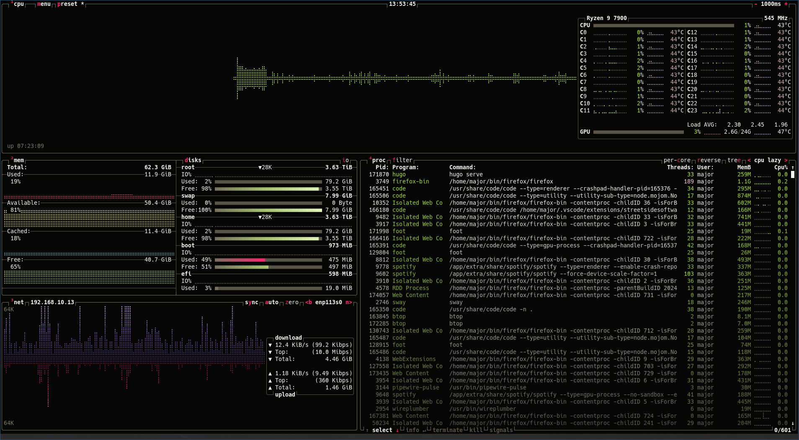
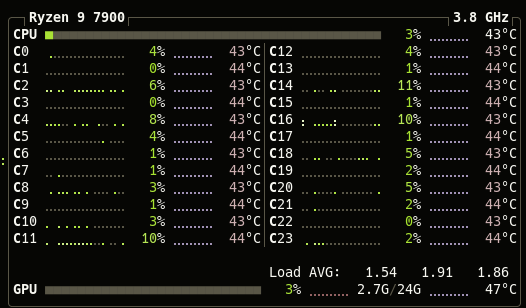

I recently built a new PC for my birthday and I splurged a bit with a new AMD Radeon 7900 XTX GPU.
Although I'm not a heavy gamer, I'm working with [LLMs](https://en.wikipedia.org/wiki/Large_language_model) more often and I'm interested to do some of this work at home.

[btop](https://github.com/aristocratos/btop) is my go-to tracker for all kinds of data about my system, including CPU usage, memory usage, disk I/O, and network throughput.
It's a great way to track down bottlenecks and find out why your CPU fan is spinning at max speed. 😜



## The problem

My GPU wasn't showing up in btop after rebuilding the system.
Normally, there's a bar for the GPU right underneath the CPU usage and it tracks the GPU usage as well as memory usage.
Some cards report thermals there, too.

The [radeontop](https://github.com/clbr/radeontop) tool worked fine and I can see the device in the hardware monitoring subsystem:

```console
> cat /sys/class/hwmon/hwmon1/name
amdgpu
```

## The solution

I installed plenty of AMD packages, but I missed a critical one: `rocm-smi`:

```console
> dnf install rocm-smi
> rocm-smi

======================================== ROCm System Management Interface ========================================
================================================== Concise Info ==================================================
Device  Node  IDs              Temp    Power  Partitions          SCLK    MCLK   Fan  Perf  PwrCap  VRAM%  GPU%  
              (DID,     GUID)  (Edge)  (Avg)  (Mem, Compute, ID)                                                 
==================================================================================================================
0       1     0x744c,   55924  47.0°C  21.0W  N/A, N/A, 0         218Mhz  96Mhz  0%   auto  327.0W  11%    10%   
==================================================================================================================
============================================== End of ROCm SMI Log ===============================================
```

That's the ticket! Now my btop data is complete.

