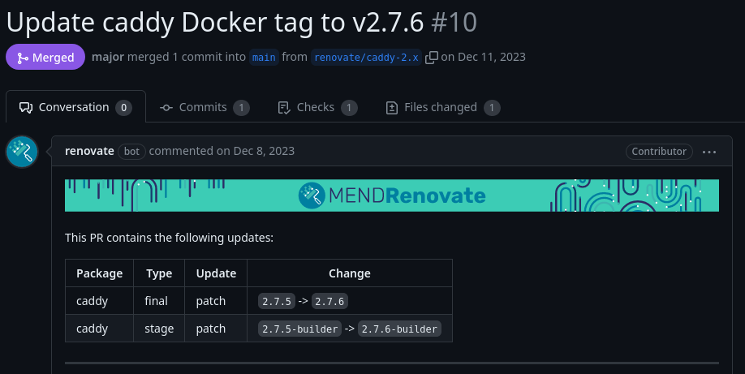

I recently told a coworker about [Caddy](https://caddyserver.com/), a small web and proxy server with a very simple configuration.
It also has a handy feature where it manages your TLS certificate for you automatically.

However, one problem I had at home with my [CoreOS](https://fedoraproject.org/coreos/) deployment is that I don't have inbound network access to handle the certificate verification process.
Most automated certificate vendors need to reach your web server to verify that you have control over your domain.

This post talks about how to work around this problem with domains registered at [Porkbun](https://porkbun.com/).

## DNS validation

Certificate providers usually default to verifying domains by making a request to your server and retrieving a validation code.
If your systems are all behind a firewall without inbound access from the internet, you can use DNS validation instead.

The process looks something like this:

1. You tell the certificate provider the domain names you want on your certificate
2. The certificate provider gives you some DNS records to add wherever you host your DNS records
3. You add the DNS records
4. You get your certificates once the certificate provider verifies the records.

You can do this manually with something like [acme.sh](https://github.com/acmesh-official/acme.sh) today, but it's **painful**:

```shell
# Make the initial certificate request
acme.sh --issue --dns -d example.com \
    --yes-I-know-dns-manual-mode-enough-go-ahead-please

# Add your DNS records manually.

# Verify the DNS records and issue the certificates.
acme.sh --issue --dns -d example.com \
    --yes-I-know-dns-manual-mode-enough-go-ahead-please --renew

# Copy the keys/certificates and configure your webserver.
```

We don't want to live this way.


Let's talk about how Caddy can help.

## Adding Porkbun support to Caddy

Caddy is a minimal webserver and [Porkbun support](https://github.com/caddy-dns/porkbun) doesn't get included by default.
However, we can quickly add it via a simple container build:

```Dockerfile
FROM caddy:2.7.6-builder AS builder

RUN xcaddy build \
    --with github.com/caddy-dns/porkbun

FROM caddy:2.7.6

COPY --from=builder /usr/bin/caddy /usr/bin/caddy
```

This is a two stage container build where we compile the Porkbun support and then use that new `caddy` binary in the final container.

We're not done yet!

## Automated Caddy builds with updates

I created a [GitHub repository](https://github.com/major/caddy) that builds the Caddy container for me and keeps it updated.
There's a [workflow to publish a container](https://github.com/major/caddy/blob/main/.github/workflows/docker-publish.yml) to GitHub's container repository and I can pull containers from there on my various CoreOS machines.

In addition, I use [Renovate](https://github.com/apps/renovate) to watch for Caddy updates.
New updates come through a [regular pull request](https://github.com/major/caddy/pull/10) and I can apply them whenever I want.



## Connecting to Porkbun

We start here by getting an API key to manage the domain at Porkbun.

1. Log into your [Porkbun dashboard](https://porkbun.com/account/domainsSpeedy).
2. Click **Details** to the right of the domain you want to manage.
3. Look for **API Access** in the leftmost column and turn it on.
4. At the top right of the dashboard, click **Account** and then **API Access**.
5. Add a title for your new API key, such as _Caddy_, and click **Create API Key**.
6. Save the API key and secrey key that are displayed.

Open up your Caddy configuration file (the _Caddyfile_) and add some configuration:

```caddyfile
{
        email me@example.com

        # Uncomment this next line if you want to get
        # some test certificates first.
        # acme_ca https://acme-staging-v02.api.letsencrypt.org/directory

        acme_dns porkbun {
                api_key pk1_******
                api_secret_key sk1_******
        }
}

example.com {
        handle {
                respond "Hello world!"
        }
}
```

Save the Caddyfile and restart your Caddy server or container.
Caddy will immediately begin requesting your TLS certificates and managing your DNS records for those certificates.
This normally finishes in less than 30 seconds or so during the first run.

If you don't see the HTTPS endpoint working within a minute or two, be sure to check the Caddy logs.
You might have a typo in a Porkbun API key or the domain you're trying to modify doesn't have the **API Access** switch enabled.


Remember that Porkbun requires you to enable API access for each domain.
API access is disabled at Porkbun by default.


**That's it!** 🎉

## Renewals

Caddy will keep watch over the certificates and begin the renewal process as the expiration approaches.
It has a very careful retry mechanism that ensures your certificates are updated without tripping any rate limits at the certificate provider.

## Further reading

Caddy's detailed documentation about [Automatic HTTPS](https://caddyserver.com/docs/automatic-https) and the [tls configuration directive](https://caddyserver.com/docs/caddyfile/directives/tls) should answer most questions about how the process works.