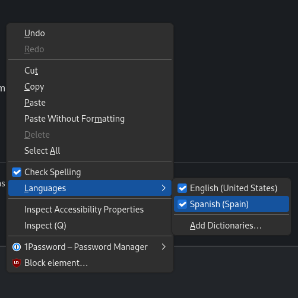

**Bienvenidos!**[^t1]
I've been learning Spanish for just over a year and I often type messages in either Spanish or English (my native language) with coworkers and friends.
Just like most people, I make spelling mistakes in both languages. 🙃

Firefox offers a feature for multi-language spell checking and translations but it can be a bit challenging to set up.
This post explains how to load languages into Firefox and use them for spell checking.

## Installing languages

Take a trip over to [Dictionaries and Languages Packs] on Mozilla's site.
Note that there are **two columns** available to you here:

* **Language packs** give you the option to change your interface language to something different than your system's default language.
* **Dictionaries** help with checking spelling.

In the second column, click on the language you want to add for checking spelling.
In my case, I picked the [Spanish (Spain) Dictionary](https://addons.mozilla.org/en-US/firefox/addon/diccionario-de-espa%C3%B1ol-espa%C3%B1a/) along with the [Spanish (Mexico) Dictionary](https://addons.mozilla.org/en-US/firefox/addon/spanish-mexico-dictionary/).
Install the dictionaries you want just like any other add-on!

Go to the `about:addons` page in Firefox and you should see your languages under **Languages** and **Dictionaries** on the left side.

## Enable the language

Find an input field and right click inside the field.
You should see a **Languages** context menu appear.
Roll over that menu and a new menu pops out to the side:

Click the checkbox to enable the languages that you want to use with the spell checker.
That takes effect immediately!

Gracias por leer hasta aquí![^t2] 😜

[^t1]: Welcome!
[^t2]: Thank you for reading this far.