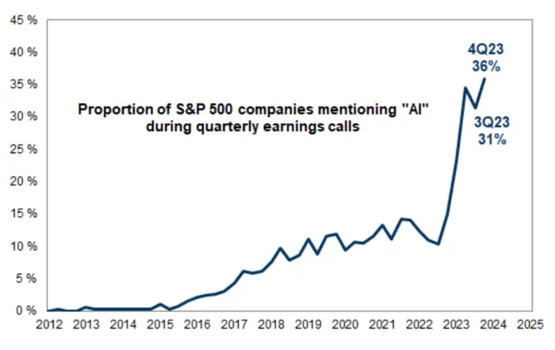

*Author's note: This post is all about my personal thoughts on artificial intelligence (AI) and they don't represent the views of any employer or group.*

----

You can't escape the clutches of AI lately.

It's in my smartphone [nestled](https://support.google.com/messages/answer/14599070?hl=en) next to my text messages.
It's in my [work chats](https://slack.com/features/ai).
It's [reading my Spanish](https://blog.duolingo.com/large-language-model-duolingo-lessons/) in Duolingo.
It's in my photo albums [retouching my images](https://blog.adobe.com/en/publish/2023/04/18/new-adobe-lightroom-ai-innovations-empower-everyone-edit-like-pro).

Sometimes we know that there's AI involved in something and sometimes we don't.

However, it seems like so many are in a rush to implement some kind of AI offering without a full idea of why they're doing it.
Here an excerpt from the [September 2024 issue](https://hbr.org/2024/09/ai-wont-give-you-a-new-sustainable-advantage) of Harvard Business Review that explains it well:

> Smart early movers in sectors adopting gen AI have certainly captured some of this value in the short term. But relatively soon all surviving companies in those sectors will have applied gen AI, and it won’t be a source of competitive advantage for any one of them, even where its impact on business and business practices will probably be profound. In fact, it will be more likely to remove a competitive advantage than to confer one. **But here’s a silver lining: If you already have a competitive advantage that rivals cannot replicate using AI, the technology may serve to amplify the value you derive from that advantage.**

AI can help you only if:

1. You have a product or service your customers value.
2. You can leverage AI for specific improvements to that product or service that make it more valuable.

## AI is not valuable alone

I'm reminded of a time in the past where I was working hard on OpenStack public clouds.
Kubernetes gained more traction day by day.
Lots of customers told us: *"I've got to get on kubernetes so I can move faster."*

As we asked more about their challenges, they listed lots of things that should look familiar:

* Developers throwing code over the wall to Q/E and Q/E delays the release
* Software passes tests in development and staging, but fails miserably in production
* Monolithic applications were crushed by load spikes
* Operations teams struggled to deploy software efficiently and reliably

They had a serious problem with delivering their software, but kubernetes couldn't make any of these better.
**Adding kubernetes would just give them two problems instead of one.**

The running joke whenever someone ran into a problem with a server, a piece of code, or a service was to say *"Why don't you rub a little kubernetes on it?"* 🤣

I'm seeing much of the same with AI as companies scramble to get their hands on the best hardware they can find and access to the highest quality large language models (LLMs) they can find.
Cloud budgets are blown wide open.
When someone asks about the AI effort, the reply is often: *"We have to get it before our competitors do, or we're sunk!"*

In February 2024, 36% of company earnings reports [mentioned AI](https://markets.businessinsider.com/news/stocks/ai-stocks-sp500-4q-tech-earnings-artificial-intelligence-goldman-sachs-2024-2?op=1) -- a record high:

How many of them are actually doing something meaningful for their employees or customers with AI?

## Work backwards from the experience

One of my coworkers, Scott McCarty, wrote a great post on InfoWorld titled ["What generative AI can do for sysadmins"](https://www.infoworld.com/article/3482087/what-generative-ai-can-do-for-sysadmins.html).
What I love most about this article is that Scott remains laser-focused on the *experiences* and *challenges* that AI could improve.

There are plenty of challenging situations that every sysadmin faces.
The worst of these are when you're under incredible pressure to bring a system back into a working state and you need to pick through tons of information to identify the problem.
You can sometimes spot these issues easily, such as a failing storage drive in a server.
Other situations are much more difficult.

The key is to **start with the experience.**
Then work backwards from there.

As an example, one pattern I often see is companies putting AI chatbots in front of their documentation.
Sometimes the chatbot will help you find the right documentation faster, but sometimes it's not much better than a CTRL-F or a quick look at the documentation's table of contents.

If your documentation is so complicated that you need to spend the time and money to put an AI chatbot in front of it, why not make your documentation better instead?

When something does fail, why not put a link to the documentation in the log message itself?
This pattern shows up a lot in modern software lately.
If I try to enable a [Tailscale exit node](/p/build-tailscale-exit-node-firewalld/) but I haven't forwarded packets on an interface, I get quick instructions on the console with a link to documentation that explains it in more detail.

**You cannot use AI to paper over a poor experience.**
Your customers will see right through it.

## Remember the human side

Sometimes companies simply try to take AI much too far and upset the human nature in all of us.

A great example of this was Google's awful Olympics ad where it shows a girl's father using Google Gemini to [write a letter to her hero](https://www.cnn.com/2024/08/02/tech/google-olympics-ai-ad-artificial-intelligence/index.html).
The reaction at my house when we saw it was: *"Wait, you're taking the time to write a letter to your hero and you're letting an AI write it? Could that be any more impersonal?"*
If I'm writing a letter or email to someone I admire, I'm taking the time to write it myself with my own voice.

Another example is a Microsoft ad showing someone turning a long document into a long slide deck instead.
If nobody wanted to read the document in the first place, why would they want to read your long slide deck?
Also, how would they feel if they know you just jammed a document into a LLM to make a slide deck and then held them hostage in a conference room as you walked through a voiceless set of slides?

This goes back to the last section, but if you're trying to add AI to replace a human interaction, think that through.
Are you papering over a bad experience?
Are you looking to cut costs without considering the customer reaction?
What's your plan if the AI interactions backfire?

## So what do we do?

If you work backwards from the customer experience and land on an LLM as the best way to solve a problem or enhance a product, that's great.
However, the experience you are enabling should be so good that:

1. Customers are genuinely delighted with the experience without knowing AI is involved
2. You don't have to mention "AI" for the experience to feel innovative and delightful
3. You have plans in place for when customers want more from the experience later

Getting hardware or cloud infrastructure together and [running an LLM on top is boring](https://cfp.fedoraproject.org/flock-2024/talk/HM9Y8U/).
Even going retrieval augmented generation (RAG) is boring.
We will soon live in a world where running an LLM is the same level of difficulty as running a web server or a container.
That's not where the value lives.

AI isn't the king.
**The experience is.**
If you forget that, you're just taking a problem and rubbing some AI on it.