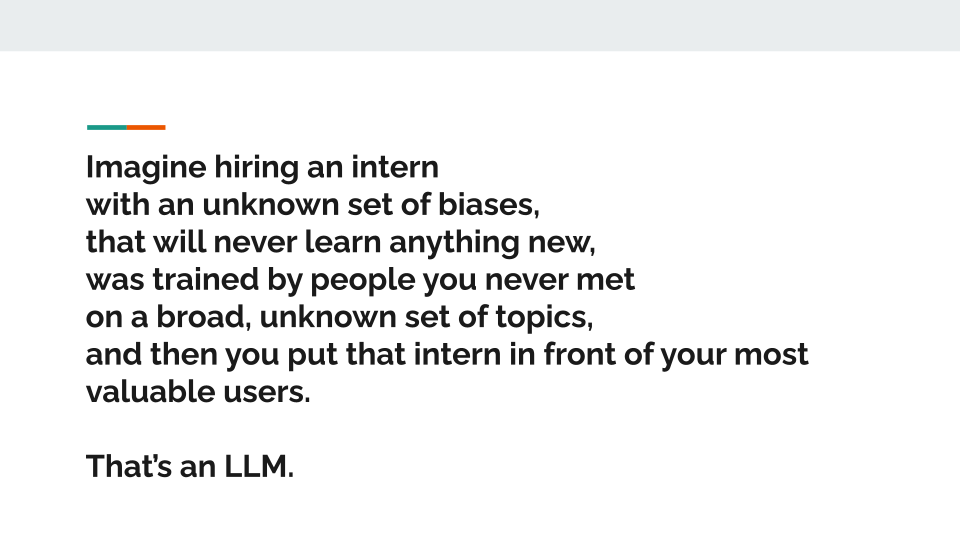
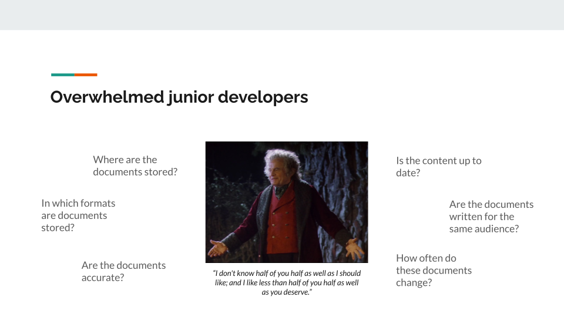
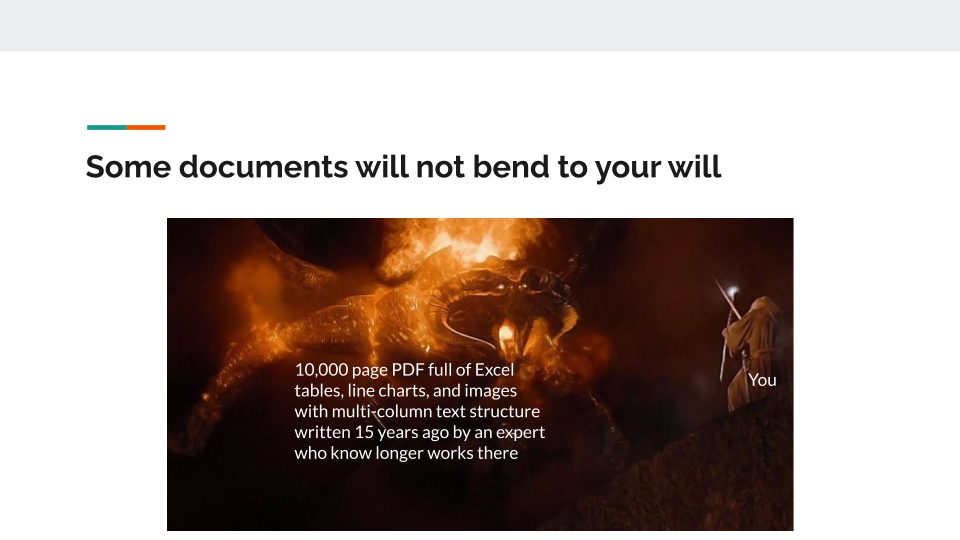
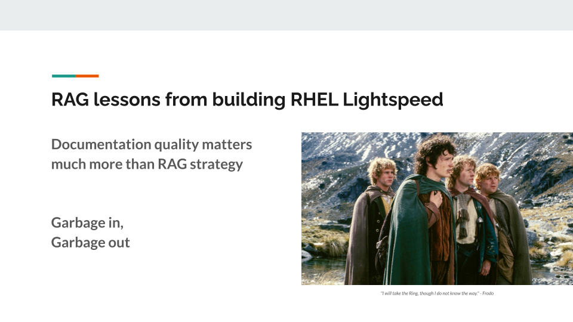

Hello from DevConf.US in Boston, Massachusetts!

I presented yesterday about the challenges of developing systems for retrieval-augmented generation (RAG) with large language models (LLMs).
If you've been reading tech blogs lately, or the [r/rag subreddit], you might think that implementing RAG is as simple as tossing documents into a database and watching the magic happen.
_(Spoiler alert: it's not.)_

I'll quickly recap the presentation in this post, but you can also download the [slides as a PDF](slides.pdf) or watch the [video on YouTube](https://www.youtube.com/live/i2H6tOu4Jyw?feature=shared&t=8709).

[r/rag subreddit]: https://www.reddit.com/r/rag/

## What RAG actually is (and isn't)

Using RAG with an LLM is a lot like taking an open-note exam.
If you know the concepts really well, but you need to quickly reference specific details, an open-note exam isn't too bad.
However, if you don't know the material at all, having notes won't help you much.
This means that the LLM that you pair with RAG needs some relevant training in the domain you're working in.

But the big question is how to increase your odds of successfully delivering coherent, complete, and correct answers when you're up against this challenge:

This is where RAG can improve your odds.

## The Fellowship of the RAG

Building a RAG system isn't a solo quest.
You need a diverse team, each bringing their own perspectives:

Your senior engineers worry about security and data compliance.
They're asking the tough questions: Is sensitive data protected? Can users access only what they should? Has the data been tampered with?

Junior developers get overwhelmed by the document chaos.
Where are documents stored? In what formats? How often do they change? Are they even accurate?

Quality engineers face a new paradigm.
Traditional deterministic testing doesn't work with AI systems that might give different answers to the same question.

And then there's the AI enthusiast who just read 20 HackerNews articles and wants to implement every new technique.
(We all know one.)

The lesson? Your fellowship matters more than your technology stack.

## Common pitfalls in the Mines of Moria

Just like the Fellowship's journey through the Mines, RAG implementation has its share of monsters lurking in the dark.

**Document parsing is harder than it looks.**
That 10,000-page PDF full of Excel tables, charts, and multi-column text written 15 years ago by someone who no longer works there?
Yeah, that's your Balrog.
Tools like Docling can help, but sometimes you need to accept that certain documents should stay buried.

**Search strategy matters.**
You'll need to choose between keyword search (fast but misses semantic meaning), vector search (understands context but requires expensive embedding), hybrid approaches, or graph-based methods.
Start simple – you can always evolve your approach.

**Model size affects everything.**
Smaller models need more accurate RAG context because they have less training to fall back on.
Frontier models like Claude Opus or GPT-4o can compensate for lower-quality RAG, but they're expensive.
Choose wisely based on your use case and budget.

## The road forward

After navigating the challenges, here are the critical lessons for building production RAG:

**Start with a clear user story.**
Define who will use your system, what they'll do with it, and what benefit they'll get.
This becomes your north star when making tough decisions.

**Build a continuous improvement pipeline.**
Set up a process to identify knowledge gaps, refine documents, score results, and only promote good content to production.
RAG isn't a deploy-and-forget solution.

**Measure everything that matters.**
Log queries, responses, similarity scores, and user feedback.
You can't improve what you don't measure.

**Documentation quality trumps RAG sophistication.**
The best RAG system in the world can't fix terrible documentation.
Garbage in, garbage out – always.

## Key takeaway

If there's one thing to remember from my talk, it's this: RAG is not a destination but an ongoing quest.
The perfect solution is the enemy of progress.
Start small, fail fast, learn constantly, and iterate relentlessly.

The slides from my presentation are available in the PDF file in this repository, and I encourage you to check them out for the full Lord of the Rings journey through RAG implementation.

Building production RAG systems taught me that success comes not from following the latest HackerNews trends, but from understanding your users, respecting the complexity, and assembling the right fellowship for the journey.

Stay on the path, and may your RAG responses be ever accurate.
