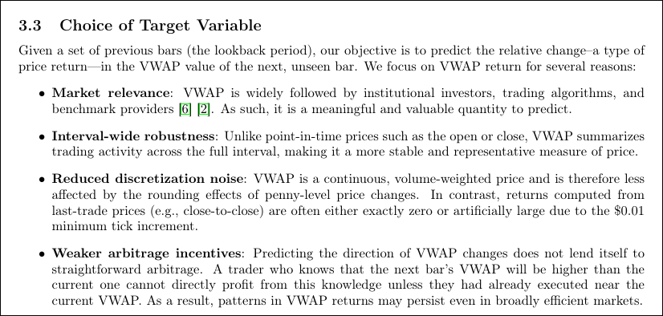

My team at work does lots of work with retrieval-augmented generation, or RAG, and parsing documents is really painful.
It's so painful that I recently delivered a talk on this very topic at [DevConf.US 2025](/p/devconf-rag/)!

Another one of the talks at DevConf.US this year was about [docling](https://docling-project.github.io/docling/).
We've been using it on our team for a while and we really enjoy how it takes challenging documents in various formats and parses them into a single, common document.

I'll walk you through setting up docling in your project and show you some fun things you can do with it.

# Adding docling to a project

I usually use [uv](https://github.com/astral-sh/uv) for my Python projects.
You can start a new project like this:

```bash
pipx install uv
mkdir fun-with-docling
cd fun-with-docling
uv init --package --name doclingfun
```

Now we can add docling to the project.
But first, I prefer to install `torch-cpu` to avoid downloading lots of unnecessary CUDA libraries if I don't need them.

Start by adding a `torch-cpu` source in your `pyproject.toml` file:

```toml
[[tool.uv.index]]
name = "torch-cpu"
url = "https://download.pytorch.org/whl/cpu"
explicit = true

[tool.uv.sources]
torch = { index = "torch-cpu" }
torchvision = { index = "torch-cpu" }
```

Then add `torch`, `torchvision`, and `docling` to your dependencies:

```bash
uv add torch torchvision docling
```

Verify the installation:

```bash
> uv run docling --version
2025-09-26 11:02:48,742 - INFO - Loading plugin 'docling_defaults'
2025-09-26 11:02:48,743 - INFO - Registered ocr engines: ['easyocr', 'ocrmac', 'rapidocr', 'tesserocr', 'tesseract']
Docling version: 2.54.0
Docling Core version: 2.48.2
Docling IBM Models version: 3.9.1
Docling Parse version: 4.5.0
Python: cpython-313 (3.13.3)
Platform: Linux-6.16.8-200.fc42.x86_64-x86_64-with-glibc2.41
```

## Parsing a document

Financial markets are a hobby of mine, so I always enjoy reading research on patterns in the market.
There's a [great document](https://arxiv.org/abs/2509.16137) that we can start with.
Download the PDF and parse it with docling:

```bash
curl -L -o enhancing_ohlc_data.pdf https://arxiv.org/pdf/2509.16137
> uv run docling enhancing_ohlc_data.pdf --from pdf --to json --output .
2025-09-26 11:07:59,958 - INFO - Loading plugin 'docling_defaults'
2025-09-26 11:07:59,959 - INFO - Registered ocr engines: ['easyocr', 'ocrmac', 'rapidocr', 'tesserocr', 'tesseract']
2025-09-26 11:07:59,964 - INFO - paths: [PosixPath('/tmp/tmp243lux62/enhancing_ohlc_data.pdf')]
2025-09-26 11:07:59,964 - INFO - detected formats: [<InputFormat.PDF: 'pdf'>]
2025-09-26 11:07:59,971 - INFO - Going to convert document batch...
2025-09-26 11:07:59,971 - INFO - Initializing pipeline for StandardPdfPipeline with options hash f1301fa0db91f613a1f4baa1a2a11518
2025-09-26 11:07:59,973 - INFO - Loading plugin 'docling_defaults'
2025-09-26 11:07:59,974 - INFO - Registered picture descriptions: ['vlm', 'api']
2025-09-26 11:08:00,241 - INFO - Accelerator device: 'cpu'
2025-09-26 11:08:01,278 - INFO - Accelerator device: 'cpu'
2025-09-26 11:08:05,085 - INFO - Accelerator device: 'cpu'
2025-09-26 11:08:05,381 - INFO - Processing document enhancing_ohlc_data.pdf
2025-09-26 11:08:51,604 - INFO - Finished converting document enhancing_ohlc_data.pdf in 51.64 sec.
2025-09-26 11:08:51,604 - INFO - writing JSON output to enhancing_ohlc_data.json
2025-09-26 11:08:51,667 - INFO - Processed 1 docs, of which 0 failed
2025-09-26 11:08:51,672 - INFO - All documents were converted in 51.71 seconds.
```

Success!
We now have a JSON file that contains the parsed document.
(If you're in a hurry and just want to view the JSON, I've [uploaded it here](enhancing_ohlc_data.json).)

Let's break down how the documents work

# Groups and texts

Groups are collections of related content.
Here's an example:

```json
"groups": [
{
    "self_ref": "#/groups/0",
    "parent": {
    "$ref": "#/body"
    },
    "children": [
    {
        "$ref": "#/texts/53"
    },
    {
        "$ref": "#/texts/54"
    },
    {
        "$ref": "#/texts/55"
    },
    {
        "$ref": "#/texts/56"
    }
    ],
    "content_layer": "body",
    "name": "list",
    "label": "list"
},
```

This group has four children which are called "texts" and we can tell that this is a list of some sort.

If we look for `#/texts/53`, we can see what the first item in the list is:

```json
{
    "self_ref": "#/texts/53",
    "parent": {
    "$ref": "#/groups/0"
    },
    "children": [],
    "content_layer": "body",
    "label": "list_item",
    "prov": [
    {
        "page_no": 4,
        "bbox": {
        "l": 86.945,
        "t": 669.104,
        "r": 540.004,
        "b": 644.616,
        "coord_origin": "BOTTOMLEFT"
        },
        "charspan": [
        0,
        187
        ]
    }
    ],
    "orig": "\u00b7 Market relevance : VWAP is widely followed by institutional investors, trading algorithms, and benchmark providers [6] [2]. As such, it is a meaningful and valuable quantity to predict.",
    "text": "Market relevance : VWAP is widely followed by institutional investors, trading algorithms, and benchmark providers [6] [2]. As such, it is a meaningful and valuable quantity to predict.",
    "enumerated": false,
    "marker": "\u00b7"
},
```

This is a single line of text from the document, but it's part of a list.
You can see the parent relationship back to `#/groups/0`.
This text has a label of `list_item` which indicates that it's part of a list.
There's also a `marker` field so you can extract the bullet point character if you want to.

What does this look like in the original document?



So if you found a piece of text that interest you, you can walk backwards to the group and then higher in the document if needed.

# Wandering around documents

Let's break out some Python and see what we can do with documents.

## Getting child items

First off, let's find that `"#/groups/0"` from earlier and get the texts inside of it:

```python
from docling_core.types.doc.document import DoclingDocument
from rich import print

doc = DoclingDocument.load_from_json("enhancing_ohlc_data.json")

# Extract group 0 and find its children.
my_group = doc.groups[0]
refs = my_group.children

# Loop through the children,
# resolve their location,
# and print the original text.
for x in refs:
    text = x.resolve(doc=doc)
    print(text.orig)
```

After running this, I get the text from the bulleted list:

```
· Market relevance : VWAP is widely followed by institutional investors, trading algorithms, and benchmark providers [6] [2]. As such, it is a meaningful and valuable quantity to predict.
· Interval-wide robustness : Unlike point-in-time prices such as the open or close, VWAP summarizes trading activity across the full interval, making it a more stable and representative measure of price.
· Reduced discretization noise : VWAP is a continuous, volume-weighted price and is therefore less affected by the rounding effects of penny-level price changes. In contrast, returns computed from last-trade prices (e.g., close-to-close) are often either exactly zero or
artificially large due to the $0.01 minimum tick increment.
· Weaker arbitrage incentives : Predicting the direction of VWAP changes does not lend itself to straightforward arbitrage. A trader who knows that the next bar's VWAP will be higher than the current one cannot directly profit from this knowledge unless they had already
executed near the current VWAP. As a result, patterns in VWAP returns may persist even in broadly efficient markets.
```

## Getting parent items

What if we wanted to go the other way around?
Perhaps there was something really good in `#/texts/55` that we wanted to find in the document.

```python
from docling_core.types.doc.document import DoclingDocument
from rich import print

doc = DoclingDocument.load_from_json("enhancing_ohlc_data.json")

# Extract text 55 and get the parent
my_text = doc.texts[55]
parent_ref = my_text.parent

# Resolve the parent reference
parent_item = parent_ref.resolve(doc=doc)
print(parent_item)
```

Run this and we get the details of `#/groups/0`:

```
ListGroup(
    self_ref='#/groups/0',
    parent=RefItem(cref='#/body'),
    children=[RefItem(cref='#/texts/53'), RefItem(cref='#/texts/54'), RefItem(cref='#/texts/55'), RefItem(cref='#/texts/56')],
    content_layer=<ContentLayer.BODY: 'body'>,
    name='list',
    label=<GroupLabel.LIST: 'list'>
)
```

## Removing items

You can also remove individual items from a document or certain classes of items.
Let's assume that you don't want any lists in your document.
You can remove them like this:

```python
from docling_core.types.doc.document import DoclingDocument, ListItem
from rich import print

doc = DoclingDocument.load_from_json("enhancing_ohlc_data.json")

total_texts = len(doc.texts)
print(f"Total texts in document: {total_texts}")

list_items = [x for x in doc.texts if isinstance(x, ListItem)]
doc.delete_items(node_items=list_items)

total_texts_after_deletion = len(doc.texts)
print(f"Total texts after deletion: {total_texts_after_deletion}")
```

Running this shows that the list items were removed:

```
> uv run python src/doclingfun/main.py
Total texts in document: 338
Total texts after deletion: 324
```

## Converting to other formats

Finally, you can convert documents to other formats.
You can certainly do something simple like this:

```python
doc.save_as_markdown("enhancing_ohlc_data_modified.md")
```

But what if we wanted our group from earlier serialized to markdown without any other document contents.
You can!

```python
from docling_core.transforms.serializer.markdown import MarkdownDocSerializer
from docling_core.types.doc.document import DoclingDocument
from rich import print

doc = DoclingDocument.load_from_json("enhancing_ohlc_data.json")

my_group = doc.groups[0]
serializer = MarkdownDocSerializer(doc=doc)
ser_res = serializer.serialize(item=my_group)
print(ser_res.text)
```

That results in the same text as before, but now the bullets are removed and replaced with Markdown-style dashes:

```
- Market relevance : VWAP is widely followed by institutional investors, trading algorithms, and benchmark providers [6] [2]. As such, it is a meaningful and valuable quantity to predict.
- Interval-wide robustness : Unlike point-in-time prices such as the open or close, VWAP summarizes trading activity across the full interval, making it a more stable and representative measure of price.
- Reduced discretization noise : VWAP is a continuous, volume-weighted price and is therefore less affected by the rounding effects of penny-level price changes. In contrast, returns computed from last-trade prices (e.g., close-to-close) are often either exactly zero or
artificially large due to the $0.01 minimum tick increment.
- Weaker arbitrage incentives : Predicting the direction of VWAP changes does not lend itself to straightforward arbitrage. A trader who knows that the next bar's VWAP will be higher than the current one cannot directly profit from this knowledge unless they had already
executed near the current VWAP. As a result, patterns in VWAP returns may persist even in broadly efficient markets.
```

# More to explore

Docling has _lots more features_ that I haven't covered here.
For example, it can do [OCR on images](https://docling-project.github.io/docling/examples/tesseract_lang_detection/).
You can also [use LLMs to help with parsing](https://docling-project.github.io/docling/examples/minimal_vlm_pipeline/).
It also comes with a great [hybrid chunker](https://docling-project.github.io/docling/examples/hybrid_chunking/#basic-usage) to break documents into smaller pieces for embedding into a RAG database.
