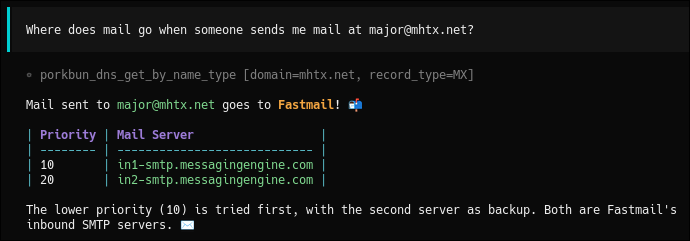

[Porkbun] does exactly what I need and nothing more.
I came to them a few years ago with domains scattered across a few different registrars that were quickly becoming too difficult to manage.
Their site has minimal upselling, quick renewals, and self-servicing your domains is easy. 🐷

I'm always on the hunt for ways to automate all of my infrastructure, so I set out to build some Porkbun automation.
However, many of the python modules for Porkbun only did certain things, such as just DNS or just buying domains.
I wanted the whole thing: domain pricing, DNS, DNSSec management.
**Everything.**

Let's dig into the code. 👨‍💻

* **Important note:** None of these projects are affiliated with Porkbun in any way.
  They're just passion projects from someone who really enjoys using their service!

[Porkbun]: https://porkbun.com

# oinker 🐖

My initial project is [oinker].
It's a simple Python client (async-first, but sync is there, too) that helps you manage all aspects of your Porkbun account in a type-safe and Pythonic way.

Here's a quick example:

```python
from oinker import AsyncPiglet, ARecord

async with AsyncPiglet() as piglet:
    # List DNS records
    records = await piglet.dns.list("example.com")
    for record in records:
        print(f"{record.record_type} {record.name} -> {record.content}")

    # Create an A record
    await piglet.dns.create(
        "example.com",
        ARecord(content="1.2.3.4", name="www")
    )
```

There's a lot more you can do with it!
The [documentation] covers lots of examples and has an extensive set of [API reference material], too.

[oinker]: https://github.com/major/oinker
[documentation]: https://major.github.io/oinker/
[API reference material]: https://major.github.io/oinker/api/client/

# porkbun-mcp 🤖

LLMs are all around us these days, right?
Sometimes I like to talk to Claude via [opencode] about my DNS records.
This gets handy when I'm struggling to find out why one of my kubernetes services isn't responding and it's due to a missing DNS record.

There's [porkbun-mcp] for that!
You can chat with LLMs about your DNS records to get advice, troubleshoot problems, or just create records on the go.



Check the [getting started] docs to configure porkbun-mcp in your favorite MCP client or LLM tool.

[opencode]: https://opencode.ai/
[porkbun-mcp]: https://github.com/major/porkbun-mcp
[getting started]: https://major.github.io/porkbun-mcp/getting-started/

# octodns-porkbun 🐙

Finally, there's [octodns-porkbun] for those who manage DNS as code with [octoDNS].
This provider plugin uses oinker under the hood and supports all the record types you'd expect.

If you're already using octoDNS to manage DNS across multiple providers, this makes it easy to add Porkbun to the mix.

[octodns-porkbun]: https://github.com/major/octodns-porkbun
[octoDNS]: https://github.com/octodns/octodns

# Pull requests welcome!

If you find a way to improve upon any of these projects, please let me know!
You can always stop by one of the repos to open an issue, fix a bug, or add a feature!
