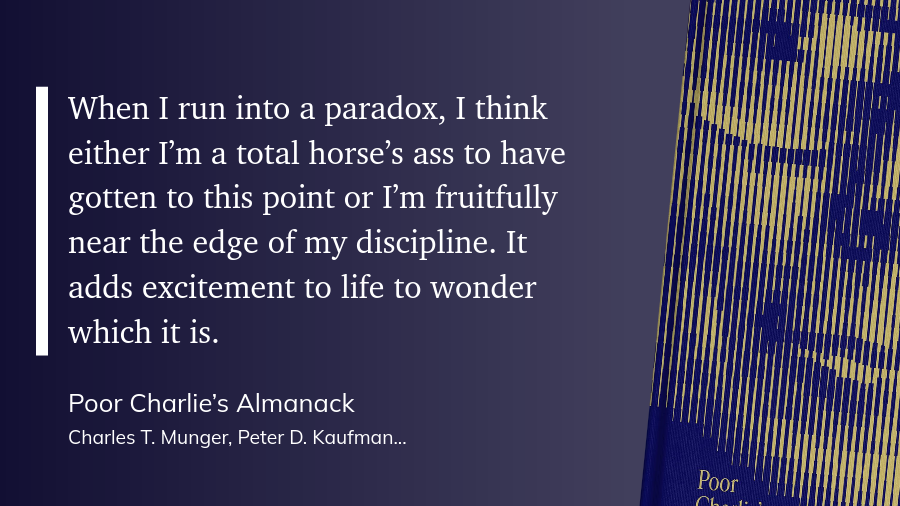

I recently finished reading [Poor Charlie's Almanac], a collection of speeches and writings from [Charlie Munger], Warren Buffett's long-time business partner at Berkshire Hathaway.
Munger passed away in November 2023 at the age of 99, just weeks before his 100th birthday.

The book consists of many of Munger's speeches over the years, most of which were delivered at graduation ceremonies or to alumni groups.
Although his speeches cover different topics, including investing, business, and life advice, they all share common themes.

If you had put in $100 when Munger joined in 1978, wou'd be sitting on $396,000 today.
It goes without saying that he was really successful at what he did.
It's **how he did it** that I found most interesting.

[Poor Charlie's Almanac]: https://en.wikipedia.org/wiki/Poor_Charlie%27s_Almanac
[Charlie Munger]: https://en.wikipedia.org/wiki/Charlie_Munger

# What made Charlie different?

Charlie Munger had an unusual, but effective market style that consisted of:

1. Doing a lot of qualitative analysis (which invites bias)
2. Working through a checklist of mental models from lots of different disciplines to identify when bias was sneaking in
3. Avoiding complexity and sticking to what he understood well
4. Focusing on long-term value rather than short-term gains

He made a point of reading widely across many subjects, not just finance or investing.
He sought out a fundamental knowledge of psychology, physics, biology, and other fields.

Charlie called this "worldly wisdom" and believed that having a latticework of mental models helped him make better decisions:

He strongly believed that learning from multiple disciplines is something that anyone can do, but it's not often taught in schools.
As usual, Charlie explained how important this is in his own direct way:

# Inversion

Part of Charlie's worldly wisdom was the ability to think in an inverted way.
This idea comes from Carl Gustav Jacob Jacobi, a 19th-century German mathematician famous for his work on elliptic functions.
The original German phrase is "man muss immer umkehren" which loosely translates to "invert, always invert."

As Munger explained: "Jacobi knew that it is in the nature of things that many hard problems are best solved when they are addressed backward."

If you want to be successful at your job, don't ask yourself what it takes to be unsuccessful.
**Ask yourself what it takes to be unsuccessful and then avoid those things.**
It's more difficult than it looks (otherwise everyone would be doing it).

For example, if you want to lose weight, don't ask yourself what you need to do to lose weight.
**Ask yourself what you need to avoid doing to gain weight.**
You might identify things like:

* Avoid eating junk food
* Avoid eating late at night
* Avoid skipping exercise

A focus on the things to avoid can help you identify the right actions to take.

# Psychology and human misjudgment

The book ends with a length speech that Munger joined together from three other speeches.
It's one of those "if you don't read anything else, read this" types of speeches and it was a great way to round out the book.
You can [download the PDF of the speech] if you want to read it yourself.

[download the PDF of the speech]: https://assets.stripeassets.com/fzn2n1nzq965/0RUnI35jpt78x10nvlO2Y/b66a46dba182182a2a0082213eafc634/SP_PCA-ZINE_2023_11_27.pdf

He talks at length about why we make bad decisions and the tendencies that lead us there.
Again, this is fundamental psychology coming back around.

Charlie suggests embracing those moments where you run into contradictions in your thinking or something doesn't feel quite right:

He hammers home the value of continuously learning.
Read new things.
Find new viewpoints.
Seek out people that challenge your mental models.

Charlie also warns against adhering to all kinds of ideologies as they can blind you.
They prevent you from seeing new opportunities and they might hide a source of danger, too.

He also recommends reading [Influence: The Psychology of Persuasion] by Robert Cialdini in this speech (and in his other speeches).
I'm reading this one now and it's great (but dense).

[Influence: The Psychology of Persuasion]: https://en.wikipedia.org/wiki/Influence:_The_Psychology_of_Persuasion

# My takeaways

I started with the audiobook on Audible (which has a great narrator), but then I bought a copy of the book so I could go back and read some of the speeches again.
Here are some of my key takeaways from the book:

## Learn constantly

Always open the door to learning, whether it's gaining new knowledge, new skills, or new perspectives.
Keep your curiosity at a high level.
Seek out new experiences.
When you run into something unfamiliar or something that challenges your closely-held beliefs, respond with curiosity rather than defensiveness.

This feels really valuable to me as I get older and I work with newer software developers, system administrators, and managers.
Their experiences and their knowledge differs from mine, but we all bring something valuable to the table.
Charlie's speeches have been a wake-up call for me to double check the openness of my mind and my desire to keep learning.

## Use inversion to solve problems

Towards the end of 2025, my stress levels were really high.
I fell off my diet, backed off on exercise, and drank more alcohol than I should have.
I was trying to figure out how to get back on track, but I was struggling.

When I finished Charlie's book, I thought about inverting my thinking:
_"If I want to be overweight, out of shape, stressed, and an alcoholic, what would I do?"_
I made a list of things to avoid doing and then flipped them around into positive actions.

I stuck that list in a place where I have to see it each day and it's much easier to work through those food and drink cravings.
When I think "Oh, I'll make this one more pull request, then run" or "Well I can start my running again tomorrow", I realize that I'm doing the behaviors that lead me in the wrong direction.
It's a great reminder.

## Be aware (not beware) of cognitive biases

We all have biases.
It's how the brain works and you can't get rid of them.
However, you **can** notice when bias is creeping into your decision making process and **hit the brakes.**

Munger hinted at a lot of this in his speeches, but Cialdani's book goes into much more detail.
I'm only about 25% done with Cialdani's "Influence" and I've already learned a lot of things I can use.

Charlie teaches that the most dangerous thing you can do is make a decision when you're fearful.
We make rash decisions when we're afraid and often regret those later.
Although we can't stop the fear from coming, we can choose how we respond to it.

# Final thoughts

Poor Charlie's Almanac is a great collection of speeches and writings from one of the most successful investors of all time.
Some of the verbiage is a little dated (the book was first published in 2005 and the first speech is from 1986), but the core ideas are timeless.

If you really want to have fun, start a new project in ChatGPT or Claude and upload the PDF of Charlie's "Psychology of Human Misjudgment" speech.
Open a chat and tell the model that you want it to interview you about a problem you're facing using Charlie's mental models and inversion techniques.
You'll be surprised at how many useful insights you can get for both your personal and professional life.
